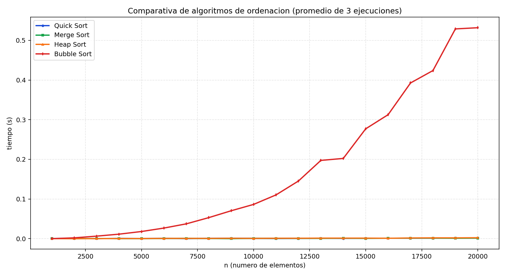

# Informe comparativo de algoritmos de ordenacion en C

## 1. Objetivo
Ampliar la practica para estudiar y comparar el comportamiento temporal y espacial de cuatro algoritmos de ordenacion sobre el mismo conjunto de datos:

- Quick Sort
- Merge Sort
- Heap Sort
- Bubble Sort

## 2. Metodologia experimental

- Lenguaje: C11.
- Datos de entrada: vectores de enteros pseudoaleatorios.
- Tamaños: desde 1000 hasta 20000 elementos, con paso de 1000.
- Repeticiones: 3 por tamaño y algoritmo.
- Medida: tiempo de CPU con `clock()` y promedio por algoritmo.
- Control de calidad: tras cada ejecucion se valida que el vector quede ordenado.

Para garantizar comparacion justa, en cada repeticion se genera un vector base y se clona para cada algoritmo. Asi todos ordenan exactamente los mismos datos.

## 3. Implementacion

Se implementaron los cuatro algoritmos en C sobre la misma estructura de datos:

- `quick_sort`: particion de Lomuto, in-place.
- `merge_sort`: mezcla recursiva con buffer auxiliar.
- `heap_sort`: construccion de heap maximo y extraccion iterativa.
- `bubble_sort`: intercambio por pares con corte anticipado si no hay cambios.

## 4. Complejidad teorica

| Algoritmo   | Tiempo promedio | Peor caso | Memoria extra |
|-------------|-----------------|-----------|---------------|
| Quick Sort  | $O(n \log n)$  | $O(n^2)$  | $O(\log n)$ promedio por recursividad |
| Merge Sort  | $O(n \log n)$  | $O(n \log n)$ | $O(n)$ |
| Heap Sort   | $O(n \log n)$  | $O(n \log n)$ | $O(1)$ |
| Bubble Sort | $O(n^2)$        | $O(n^2)$  | $O(1)$ |

## 5. Resultados obtenidos

Archivo de tiempos generado:

- `tiempos_ordenacion.tsv`

Grafica comparativa unica:



Archivo legado mantenido por compatibilidad:

- `tiemposFibonacciRecursivo.txt` (columna de Quick Sort)

## 6. Analisis del comportamiento

Los resultados muestran una separacion clara entre familias de complejidad:

- Quick Sort, Merge Sort y Heap Sort mantienen tiempos bajos y crecimiento suave con el tamaño de entrada, en linea con $O(n \log n)$.
- Bubble Sort crece mucho mas rapido y domina el tiempo total al aumentar $n$, en linea con $O(n^2)$.

En los tamaños medidos, Quick Sort y Merge Sort suelen presentar mejor tiempo medio que Heap Sort, mientras Bubble Sort queda claramente por detras.

Las pequeñas variaciones locales entre puntos consecutivos son normales y se deben a:

- cambios del planificador del sistema,
- efectos de cache y jerarquia de memoria,
- granularidad de la medicion temporal.

## 7. Coste de CPU y memoria

Como alumno, la conclusion principal sobre coste computacional es:

- El coste de CPU queda dominado por la complejidad temporal: Bubble Sort se encarece rapidamente, mientras los otros tres algoritmos escalan mucho mejor.
- En memoria, Merge Sort paga un coste adicional importante por su buffer auxiliar $O(n)$.
- Quick Sort y Heap Sort son mas contenidos en memoria auxiliar, aunque Quick Sort depende de la profundidad de recursion.

Por tanto, para conjuntos medianos y grandes:

- Bubble Sort solo tiene sentido didactico.
- Quick Sort, Merge Sort y Heap Sort son opciones practicas.
- Si priorizo memoria, Heap Sort es atractivo.
- Si priorizo estabilidad de ordenacion, Merge Sort es preferible.

## 8. Reproducibilidad

### Compilar

```bash
gcc -std=c11 -O2 -Wall -Wextra -Wpedantic main.c quick_sort.c vector_dinamico.c -o quick_sort_benchmark.exe
```

### Ejecutar benchmark

```bash
./quick_sort_benchmark.exe
```

### Generar grafica

```bash
python generar_grafica.py
```

## 9. Conclusiones finales

La ampliacion de la practica permite observar con datos reales que la complejidad asintotica no es solo teoria: se refleja de forma directa en el coste de CPU medido. La comparativa en una sola grafica facilita ver la diferencia entre algoritmos eficientes y no eficientes para entradas grandes.

Desde el punto de vista de ingenieria, no existe un algoritmo universalmente mejor en todos los criterios: la seleccion depende del equilibrio entre tiempo, memoria y propiedades extra (como estabilidad). Esta practica consolida precisamente ese criterio de decision.
